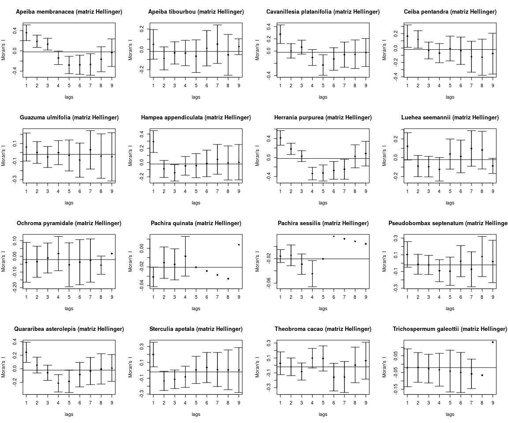
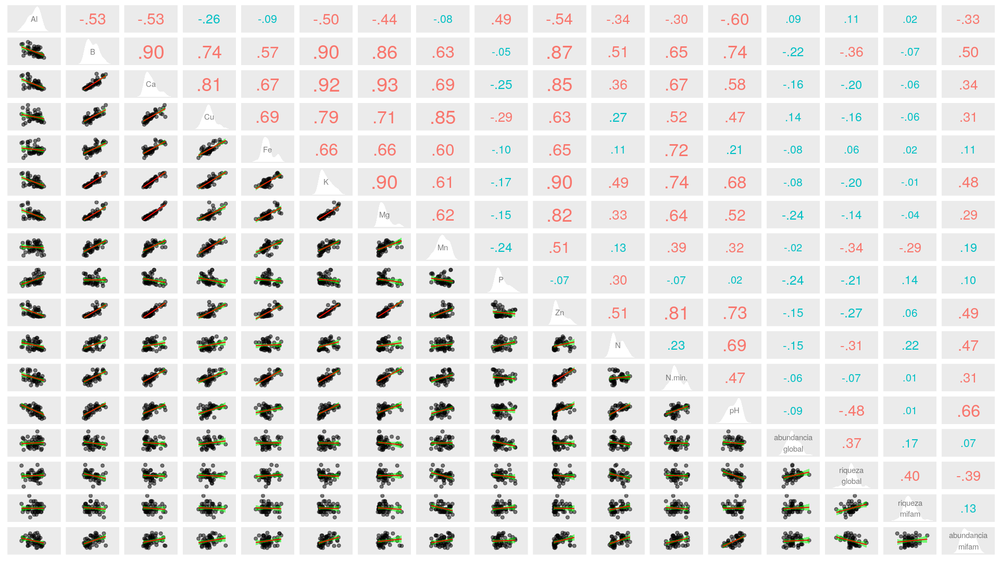
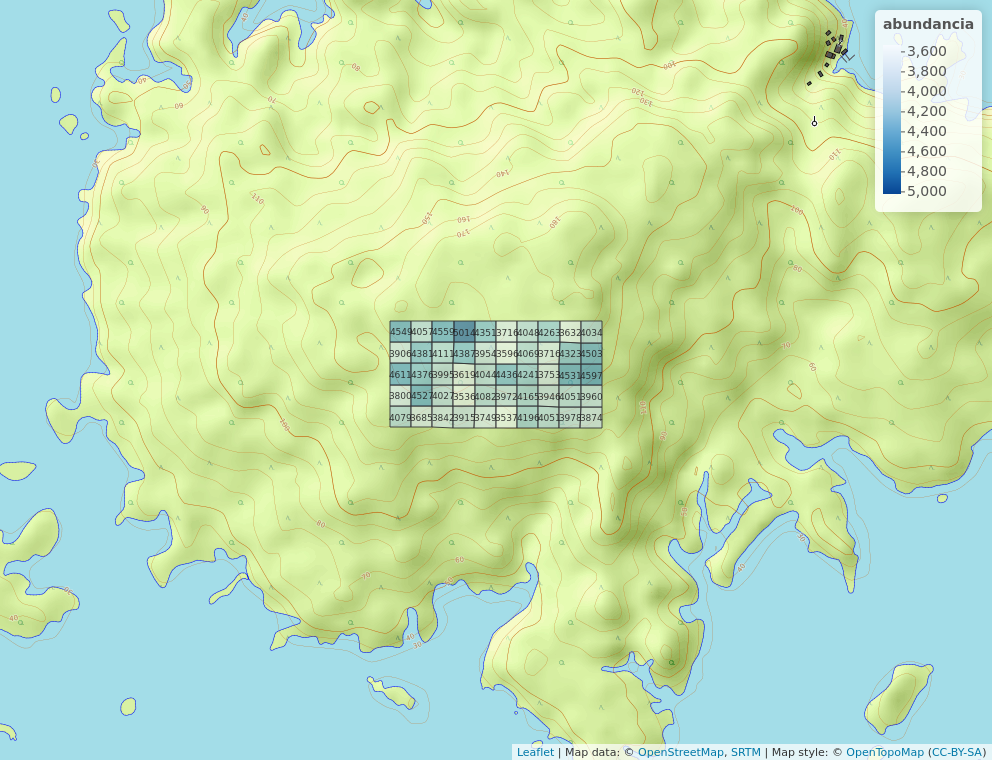
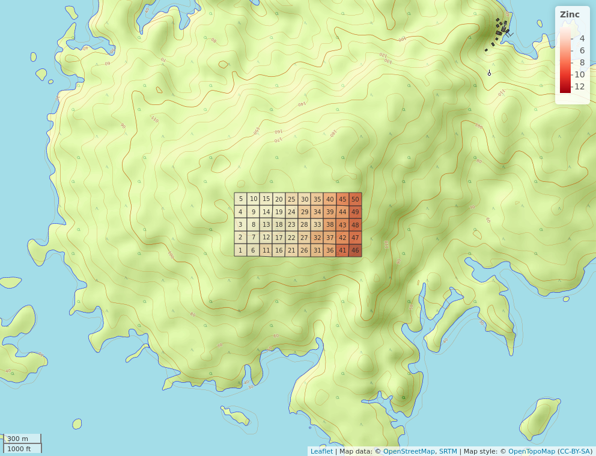
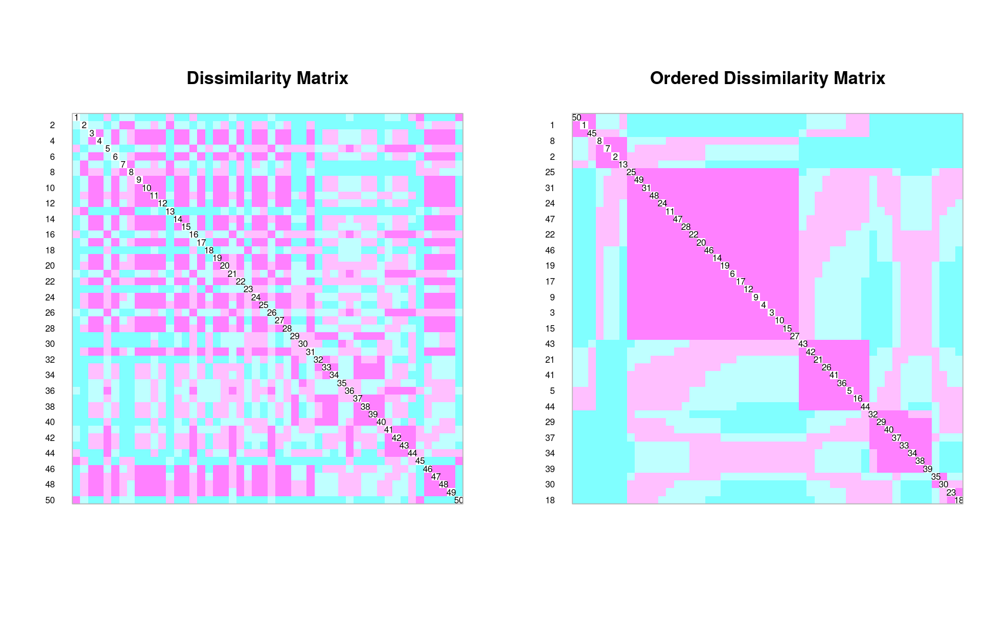
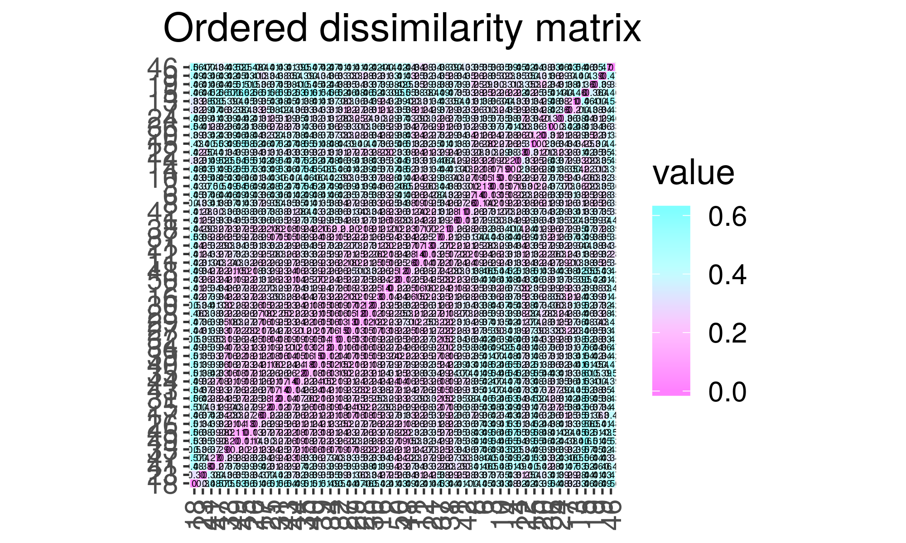
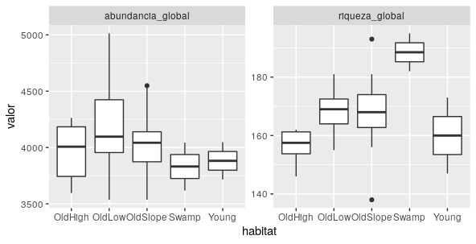

# Introducción

La vegetación terrestre está constituida por un conjunto de plantas pertenecientes a una familia en específico y esta a su vez se subdividen en géneros y especies para identificarse dentro de su clase. Por consiguiente, no sería la excepción de la *Malvaceae* la cual posee 243 genéros y más de 4,300 especies, sus flores son hermafroditas, pocas veces unisexuales, solitarias o fasciculadas en las axilas de las hojas o agrupadas en inflorescencia tal como la describen los siguientes autores [@marinanalisis] y [@bayer2003malvaceae].


Dentro de los géneros a encontrar en la familia *Malvaceae* están el *Abutilon* constituido por arbustos, subarbustos y hierbas bienales con pelo estrellados y tallos velloso, son carente del epicáliz conjunto de apéndices que por lo regular tienen otros grupos de dicha familia, así como de tener alrededor de 150 especie nativa en los trópicos y subtrópicos de América, África, Asia y Australia, [@de2007especies]. También, está el *Hibiscus* donde los segmentos del epicáliz estan libres o unidos en la base, con estigmas alargados, semillas reniformes y numerosas, [@ortizclaves]. Del mismo modo, se encuentra la *Althaea*, *Lavatera* y la *Malva* cada una contienen sus respectivas especies las cuales pueden encontrarse en mayor o menor proporción en un espacio determinado el cual dependerá de factores abioticos incidentes entre ellos, lo que implicaría la necesidad de utilizar tecnicas y análisis numerológicos para conocer su asocianción y distribución. 


La implementación de análisis numéricos en las investigaciones ecológicas permiten dar a conocer en terminos cuantificables la forma en que se encuentran asociadas y el tipo de patrón que presenta algunas especies, es por ello la importancia de la estratificación y zonificación del objeto de estudio en cuestión. De acuerdo con [@gonzalez2006ecologia] esto permite conjugar en un mismo grupo información de aquellos organismos que pueden ser cálculable junto con otros que son reproductivos y de manera general con toda la vegetación. 


En tal sentido, este estudio por medio de la ecología numérica busca conocer cómo estan asociados los diferentes géneros y especies de la familia *Malvaceae* y si las variables ambientales existente en la zona influyen en dicha asociación. También, analizar como estan organizados los grupos y qué patrón presenta en su distribución, asimismo, establecer los indicadores ambientales que interfieren. De igual manera, examinar en qué volumen se encuentran representadas cada una y distiguir los sitios con especies alpha y beta. Por consiguiente, este estudio contribuirá al conocimiento de la dinámica ecológica espacial que envuelven las plantas pertenecientes a esta familia en la isla de Barro Colorado que en lo adelante será llamado BCI y con la misma gestionar estrategias para el cuidado y conservación de ésta. 

# Metodología

## Área de estudio

La BCI se encuentra ubicada en el canal de Pánama en las proximidades del lago Gatún, de acuerdo con [@perez2005metodologia] esta se formó cuando se construyó dicho canal embalsando las aguas del río Chagres, se localiza entre las coordenadas geográficas (latitud 9$^\circ$&nbsp;9'N, longitud 79$^\circ$&nbsp; 50') y cubre una extensión de tierra de 1,500 hectáreas (ver figura \ref{mapa}). El clima se caracteriza por ser de bosque tropical, la temperatura promedio es de 27 grados centígrados, con temporadas lluviosas durante los meses mayo a diciembre y secas desde mediados de diciembre hasta abril, las tormentas convectivas son prevenidas por los vientos alisios dictando así las estaciones del año, [@sugastimedicion]. Esta isla por sus caracteristicas físicas sirve de hábitat para muchos animales e insectos y por consiguiente para una variedad de especie vegetal, convirtiendola en un espacio de investigación de mucha importancia. Es por ello, la escogencia como lugar de estudio la parcela permanente de 50 hectárea de BCI, en la cual se identificó como estan asociadas y distribuidas la familia *Malvaceae* a través del censo realizado por [@webcenso] durante varios años (1981-1983 y 2010-2015, entre otros) donde se marcaron y cartografiaron todos los tallos leñosos independientes de al menos 10 mm de diámetro de altura.

{width=80%}

### Materiales y Técnicas de investigación

Para la realización de este estudio se utilizó el software de [@R] donde se cargaron varios paquetes de ecología numérica como el *tidyverse* que ayudó a formar matriz de comunidad que permitió identificar las diferentes especies que abundan, en qué cantidad y orden de acuerdo a su pH. También, el *Simple Features* (sf) para crear área de hábitat por cuadros y obtener la densidad de cada especie por metro cuadrado y así conocer la abundancia y riqueza global. De igual manera, el *Vegan* para caracterizar y analizar el orden y disimilaridades entre cada especie y *ez* para examinar las unidades o variables repetitivas. Asimismo, el *graphics*, *psych* y *mapvie* para la representación gráfica de cada datos y [@biodiversidad] para señalar las especies alpha y beta. Por último, cada *script* utilizados fueron suministrado a partir del repositorio de [@jose_ramon_martinez_batlle_2020_4402362] como fuente y el programa de información geográfica Qgis [@QGIS_software] para actualizar el mapa de localización de la BCI.

# Resultados

Por medio de los datos obtenidos a través del análisis de agrupamiento al dividir el espacio en dos grupos uno con 42 y otro con 8 sitio, se observó que existen 16 especies de la familia *Malvaceae* con una distancia muy corta dentro de la parcela de 50\,ha. Siendo la *Quararibea asterolepis* la que más se asocia en el primero con 2,171 y la *Sterculia apetala* en el segundo con 53 para un índice de 0.978 y 0.914 respectivamente. En cuanto, al nivel de representación y composición por cada 1\,ha con el método *Hellinger* se formaron cluster donde la similaridad fue numerosa y la dispariedad corta entre la cantidad de individuo desde los cuadros 33 hasta el 49, en tanto que, en el 8, 23, 30 y 35 fueron poco similares y con intervalo largo. De igual manera, en la correlación de la diversidad de especie existió una equidad en su distribución, al aplicar el índice de *Hill* la ratio no fueron afectadas a pesar de aumentar o disminuir las riquezas, (ver figura \ref{ambiente} & \ref{riquezas}). También, se encontró una adecuación positiva en la zona del espolon,vaguada y vertiente, al igual, que entre los componentes químicos del *calsio* (Ca), *cobre* (Cu), *hierro* (Fe) y *zinc* (Zn), asimismo, una negativa en el piedemonte, el valle y la sima y en los elementos de *manganeso* (Mn) y *aluminio* (Al), esto al emplear la prueba *Moran's*, ver figura \ref{diversidad}. Por otro lado, la mayor riqueza en especie alpha fue el espacio 30 con 13 y el de menor el 45 con 5 y abundancia de 110 y 123 cosecutivamente, los que más varían el 13 y 46. Por último, las especies que más contribuyen a la pluralidad beta son *Quararibea asterolepis* y la *Hampea appendiculata* con valor de 0.18 y 0.14 sucesivamente, (ver tabla \ref{tabla}).

{width=100%}

{width=110%}

{width=110%}

Especie contribuidora a la diversidad beta\label{tabla}

|Especie                | Valor|
|:----------------------|-----:|
|Apeiba membranacea     |  0.08|
|Apeiba tibourbou       |  0.07|
|Hampea appendiculata   |  0.14|
|Herrania purpurea      |  0.11|
|Luehea seemannii       |  0.09|
|Quararibea asterolepis |  0.18|

# Discusión

La forma en que se encuentran asociados y distribuidos los géneros y especies de la familia *Malvaceae* en la parcela de 50\,h de la BCI se debe a factores abióticos como el tipo de formación de suelo, determinado compuesto químico y por la presencia del pH los cuales influyen de manera directa en su ordenación creando una dependencia entre los grupos afectando su heterogeneidad. Aunque, el exceso de ciertos elementos pueden afectar la distribución y crecimiento de ciertas plantas [@clark2002factores], así, como el origen de formación del suelo los cuales ofrecen ciertas propiedades que definirían el tipo de colocación [@flores2015distribucion]. En tal sentido, estos factores ayudaron a formar patrones de agromeración en la zona media de la isla, especialmente en la Vaguada, el espolón y la vertiente donde los elementos como el *zinc* (Zn), el *boro* (B) y el *potasio* (K) fueron determinante, a diferencia de los espacios del piedemonte, el valle, la sima y el conjunto de compuesto químici como el *manganeso* (Mn), *cobre* (Cu) y el *aluminio* (Al) donde la correlación fue menor. De igual modo, se identificó las plantas *Quararibea asterolepis* y *Sterculia apetala* como las que más se asocian de manera combinada dentro de la familia y de manera desigual en el espacio, esto posiblemente se deba a que fungen como alimento o refugio para otros grupos [@alvarado2011caracterizacion] las cuales se encuentran dispersas por todo el terreno. Esta familia tiene alto nivel de representación por cada 1\,h, específicamente en los bordes, como resultado de las condisiones climáticas y a la disponibilidad del agua [@stevenson2008determinantes] existente en esa área. Al mismo tiempo, por tener aportaciones de otras clases como la *Apeiba membranacea*, *Hampea appendiculata* entre otras, que contribuyen a la variación espacial de la diversidad entre sitios.

# Agradecimientos

Este estudio fue realizado gracias al Dr. José Ramón Martínez Batlle maestro de la asignatura de Biogeografía en la Universidad Autónoma de Santo Domingo (UASD) quién por medio de la escuela de geografía incentiva al conocimiento a través de la investigación de caracter científico. También, al Instituto Smithsonian de Instigaciones Tropicales por suministrar los datos, reslutado de años de observaciones y puesto a la disposición mediante censos. 

# Información de soporte
{width=110%}

{width=110%}

{width=110%}

{width=110%}

# *Script* reproducible

```{r, eval=FALSE}
library(vegan)
library(adespatial)
library(broom)
library(tidyverse)
library(sf)
library(gclus)
source('biodata/funciones.R')

load('biodata/matriz_ambiental.Rdata')
load("~/unidad-0-asignacion-99-mi-manuscrito-anavalera29/biodata/Malvaceae.Rdata")

mi_fam_t <- mc_malvc %>% 
  rename_all(gsub, pattern = ' ', replacement = '\n') %>% 
  t()
mi_fam_t %>% tibble
 
mi_fam_t_chi <- decostand(mi_fam_t, "chi.square")
mi_fam_t_chi %>% tibble
 
mi_fam_t_chi_d <- dist(mi_fam_t_chi)
mi_fam_t_chi_d %>% tidy
 
coldiss(mi_fam_t_chi_d, diag = TRUE)

mi_fam_t_jac <- vegdist(mi_fam_t, "jaccard", binary = TRUE)
mi_fam_t_jac %>% tidy
coldiss(mi_fam_t_jac, diag = TRUE)

env_num <- bci_env_grid %>%
  dplyr::select_if(is.numeric) %>%
  dplyr::select(-id, -matches('^U.*')) %>% 
  st_drop_geometry %>% 
  mutate(
    riqueza_mifam = specnumber(mc_malvc),
    abundancia_mifam = rowSums(mc_malvc)) %>% 
  rename_all(gsub, pattern = '_pct$', replacement = '') %>% 
  rename_all(gsub, pattern = '_| ', replacement = '\n')
env_num %>% tibble
```

```{r, eval=FALSE}
#Medición de asociación con el modo Q: matriz de disimilaridad. 
library(vegan)
library(adespatial)
library(broom)
library(tidyverse)
library(sf)
library(cluster)
library(gclus)
source('biodata/funciones.R')

load('biodata/matriz_ambiental.Rdata')
load("~/unidad-0-asignacion-99-mi-manuscrito-anavalera29/biodata/Malvaceae.Rdata")

#' matriz de distancia euclídea, utilizando la transformación *Hellinger*:
#' 
mi_fam_d_hel <- dist.ldc(mc_malvc, "hellinger", silent = T)
mi_fam_d_hel %>% tidy # Para evitar desbordar la consola
 
coldiss(mi_fam_d_hel, diag = T)

coldissgg(mi_fam_d_hel, ordered = T, nc = 4, fsz = 0)

coldissgg(mi_fam_d_hel, ordered = T, nc = 4, fsz = 1.5)
 
png(
  filename = 'matriz_disimilaridad_hellinger.png',
  width = 2400, height = 1200, pointsize = 32
)
coldiss(mi_fam_d_hel, diag = T)
dev.off()

**distancia de Jaccard** (**D<sub>J</sub>**) en un único paso usando la función `vegdist`.
#' 
mi_fam_jac <- vegdist(mc_malvc, method = 'jac', binary = T)
mi_fam_jac %>% tidy # Mostrando sólo las primeras 10 combinaciones en modo data.frame

coldiss(mi_fam_jac, diag = T)

#' 
(1 - mi_fam_jac) %>% tidy %>% rename(similaridad=distance) #Similaridad

#' La fórmula de la similaridad de Jaccard es **S<sub>J</sub>=a/(a+b+c)**, donde **a** es el número de especies compartidas (presentes en ambos sitios comparados), **b** el número de especies exclusivas del sitio 2, y **c** el número de especies exclusivas del sitio 1.
#' 
mi_fam_abc <- betadiver(mc_malvc) 
mi_fam_abc %>%
  map(tidy) %>%
  map(slice, 1) %>%
  map_df(I, .id = 'tipo') %>% 
  dplyr::select(tipo, n_especies=distance)

round(11/12*100,2) #Porcentaje de especies compartidas = similaridad

#' índices de similaridad. Por ejemplo, el Jaccard se calcula así:
#' 
betadiver(mc_malvc, method = 'j') %>% tidy

#' Además de la distancia de Jaccard, otra distancia muy utilizada es la de Sorensen o Bray-Curtis. Se calcula fácilmente con la función `vegdist`:
#' 
mi_fam_sor <- vegdist(mc_malvc, method = 'bray', binary = T)
mi_fam_sor %>% tidy
coldiss(mi_fam_sor, diag = T)
#' 
#' ### Modo Q para datos cuantitativos, NO de abundancia de especies (variables ambientales)
 
env_suelo_punt_z <- bci_env_grid %>%
  st_drop_geometry() %>% 
  dplyr::select(matches('^[A-T,Z]|^pH$', ignore.case = F)) %>% 
  scale()
env_suelo_punt_z_d <- dist(env_suelo_punt_z)
env_suelo_punt_z_d %>% tidy
coldiss(env_suelo_punt_z_d, diag = T)
#'
#' ### Modo Q para datos cualitativos y cuantitativos (mixtos), NO de abundancia de especies (variables ambientales)
#' 

env_mix <- bci_env_grid %>%
  st_drop_geometry() %>%
  dplyr::select(heterogeneidad_ambiental, habitat, quebrada)
env_mix_d <- daisy(x = env_mix, metric = 'gower')
env_mix_d %>% as.dist %>% tidy
env_mix_d %>% coldiss(diag = T)
#'
```

```{r, eval=FALSE}
#'Medición de asociación de especie modo R

library(vegan)
library(adespatial)
library(broom)
library(tidyverse)
library(sf)
library(gclus)
source('biodata/funciones.R')

load('biodata/matriz_ambiental.Rdata')
load("~/unidad-0-asignacion-99-mi-manuscrito-anavalera29/biodata/Malvaceae.Rdata")
#'
#' ## Modo R: matrices de dependencia entre variables (índice de correlación)
#' 
#' ### Modo R para datos cuantitativos de especies (abundancia)

mi_fam_t <- mc_malvc %>% 
  rename_all(gsub, pattern = ' ', replacement = '\n') %>% 
  t()
mi_fam_t %>% tibble
#' 
#' Segundo, transformo la matriz transpuesta usando estandarización *Chi*.
#' 
mi_fam_t_chi <- decostand(mi_fam_t, "chi.square")
mi_fam_t_chi %>% tibble
#' 
#' Tercero,  calculo la distancia euclídea.
#' 
mi_fam_t_chi_d <- dist(mi_fam_t_chi)
mi_fam_t_chi_d %>% tidy
#' 
#' Finalmente, creo el "mapa de calor".
#' 
coldiss(mi_fam_t_chi_d, diag = TRUE)

#' ### Modo R para datos binarios (presencia/ausencia)
 
mi_fam_t_jac <- vegdist(mi_fam_t, "jaccard", binary = TRUE)
mi_fam_t_jac %>% tidy
coldiss(mi_fam_t_jac, diag = TRUE)
#'
#' ### Modo R para datos cuantitativos, NO de abundancia de especies (variables ambientales)

env_num <- bci_env_grid %>%
  dplyr::select_if(is.numeric) %>%
  dplyr::select(-id, -matches('^U.*')) %>% 
  st_drop_geometry %>% 
  mutate(
    riqueza_mifam = specnumber(mc_malvc),
    abundancia_mifam = rowSums(mc_malvc)) %>% 
  rename_all(gsub, pattern = '_pct$', replacement = '') %>% 
  rename_all(gsub, pattern = '_| ', replacement = '\n')
env_num %>% tibble
```

```{r, eval=FALSE}
#'Técnica de ordenación

library(vegan)
library(tidyverse)
library(sf)
library(mapview)
source('biodata/funciones.R')
#' 
#' ### Cargar datos
#' 
load("~/unidad-0-asignacion-99-mi-manuscrito-anavalera29/biodata/Malvaceae.Rdata")
load('biodata/matriz_ambiental.Rdata')
mi_fam <- mc_malvc
(colnames(mi_fam) <- make.cepnames(colnames(mi_fam)))
(df_equivalencias <- data.frame(
  nombre_original = colnames(mc_malvc),
  colnames(mi_fam)))
bci_env_grid %>% tibble
grupos_upgma_k2 <- readRDS('grupos_upgma_k2.RDS')
table(grupos_upgma_k2)
grupos_ward_k2 <- readRDS('grupos_ward_k2.RDS')
table(grupos_ward_k2)
#'Matriz de correlaciones y obtener vectores propios para el PCA.
#' 
env_suelo <- bci_env_grid %>%
  st_drop_geometry %>%
  dplyr::select(matches('^[A-T,Z]|^pH$', ignore.case = F))
env_suelo %>% tibble
env_suelo_pca <- rda(env_suelo, scale = TRUE)
env_suelo_pca
summary(env_suelo_pca)

#' 
screeplot(env_suelo_pca, bstick = TRUE)
#' 
#' Usando función `cleanplot.pca`
#' 
par(mfrow = c(1, 2))
cleanplot.pca(env_suelo_pca, scaling = 1, mar.percent = 0.08, cex.char1 = 1.5)
cleanplot.pca(env_suelo_pca, scaling = 2, mar.percent = 0.04, cex.char1 = 1.5)
par(mfrow = c(1, 1))
#' 
#' Comparar distribución de los sitios en biplots con distribución real en el mapa:
#' 
#' ### Generar mapa de cuadros sin simbología
#' 
mapa_cuadros <- mapView(
  bci_env_grid,
  col.regions = 'grey80',
  alpha.regions = 0.3,
  map.types = 'OpenTopoMap',
  legend = F, zoom = 14,
  zcol = 'id') %>% addStaticLabels() %>%
  leaflet::setView(
    lng = -79.85136,
    lat = 9.15097,
    zoom = 15)
mapa_cuadros
#' 
#' Comparar con resultados de un análisis de agrupamiento del mismo conjunto de datos. Primero agrupo mis sitios basado en la misma matriz ambiental fuente del PCA (`env_suelo`), escalándola.
#' 
(env_agrupamiento <- hclust(dist(scale(env_suelo)), 'ward.D'))
(env_grupos <- cutree(env_agrupamiento, k = 3))
(mi_cluster <- factor(env_grupos))
(mi_cluster_l <- levels(mi_cluster))
(mi_cluster_l_seq <- 1:length(mi_cluster_l))

#' 
(puntuaciones <- scores(env_suelo_pca, display = 'wa', scaling = 1))
#'
#' Luego creo el gráfico base, coloco los puntos sobre el gráfico usando las puntuaciones, les coloco rótulos y, finalmente, coloco leyenda:
#'
grafico_base <- plot(
  env_suelo_pca,
  display = "wa",
  scaling = 1,
  type = "n",
  main = "PCA y grupos"
)
abline(v = 0, lty = "dotted")
abline(h = 0, lty = "dotted")
for (i in mi_cluster_l_seq) {
  points(puntuaciones[mi_cluster == i, ],
         pch = (14 + i),
         cex = 2,
         col = i + 1)
}
text(puntuaciones, row.names(env_suelo), cex = 1, pos = 3)
legend(
  "topright", # Otras alternativas: "bottomleft", "bottomright" y "topleft"
  paste("Grupo", c(mi_cluster_l_seq)),
  pch = 14 + c(mi_cluster_l_seq),
  col = 1 + c(mi_cluster_l_seq),
  pt.cex = 2
)

# (mi_cluster_anterior <- grupos_upgma_k2)
(mi_cluster_anterior <- grupos_ward_k2)
(mi_cluster_anterior_l <- levels(mi_cluster_anterior))
(mi_cluster_anterior_l_seq <- 1:length(mi_cluster_anterior_l))
grafico_base <- plot(
  env_suelo_pca,
  display = "wa",
  scaling = 1,
  type = "n",
  main = "PCA y grupos"
)
abline(v = 0, lty = "dotted")
abline(h = 0, lty = "dotted")
for (i in mi_cluster_anterior_l_seq) {
  points(puntuaciones[mi_cluster_anterior == i, ],
         pch = (14 + i),
         cex = 2,
         col = i + 1)
}
text(puntuaciones, row.names(env_suelo), cex = 1, pos = 3)
legend(
  "topright", # Otras alternativas: "bottomleft", "bottomright" y "topleft"
  paste("Grupo", c(mi_cluster_anterior_l_seq)),
  pch = 14 + c(mi_cluster_anterior_l_seq),
  col = 1 + c(mi_cluster_anterior_l_seq),
  pt.cex = 2
)
 
#' #### PCA aplicado a datos de comunidad transformados
#' 
mi_fam_hel <- decostand(mi_fam, method = 'hellinger')
mi_fam_hel %>% tibble
mi_fam_hel_pca <- rda(mi_fam_hel)
summary(mi_fam_hel_pca)
screeplot(
  mi_fam_hel_pca,
  bstick = TRUE,
  npcs = length(mi_fam_hel_pca$CA$eig)
)
mi_fam_hel_pca_sc1 <- scores(mi_fam_hel_pca,
                             display = "species", scaling = 1)
mi_fam_hel_pca_sc2 <- scores(mi_fam_hel_pca,
                             display = "species", scaling = 2)
par(mfrow = c(1, 2))
cleanplot.pca(mi_fam_hel_pca, scaling = 1, mar.percent = 0.06, cex.char1 = 0.7)
cleanplot.pca(mi_fam_hel_pca, scaling = 2, mar.percent = 0.06, cex.char1 = 0.7)
par(mfrow = c(1, 1))

biplot(
  mi_fam_hel_pca,
  main = "PCA, escalamiento 2, ajuste a variables ambientales")
(mi_fam_hel_pca_envfit <- envfit(mi_fam_hel_pca, env_suelo, scaling = 2))
plot(mi_fam_hel_pca_envfit, p.max = 0.05 , col = 3)

env_num <- bci_env_grid %>%
  select_if(is.numeric) %>%
  select(-id) %>%
  st_drop_geometry
(mi_fam_hel_pca_envfit_num <- envfit(mi_fam_hel_pca, env_num, scaling = 2))
biplot(
  mi_fam_hel_pca,
  main = "PCA, escalamiento 2, ajuste a variables ambientales")
plot(mi_fam_hel_pca_envfit_num, p.max = 0.05 , col = 3)
biplot(
  mi_fam_hel_pca,
  main = "PCA, escalamiento 2, ajuste a variables ambientales")
plot(mi_fam_hel_pca_envfit_num, p.max = 0.1 , col = 3)
 
#' ### Análisis de correspondencia (CA)
#' 
mi_fam_ca <- cca(mi_fam)
summary(mi_fam_ca)
summary(mi_fam_ca, scaling = 1)
#'
#' Screeplot
#' 
screeplot(mi_fam_ca, bstick = TRUE, npcs = length(mi_fam_ca$CA$eig))
#'
#' Biplots
#' 
par(mfrow = c(1, 2))
plot(mi_fam_ca,
     scaling = 1,
     main = "Análisis de correspondencia, escalamiento 1"
)
plot(mi_fam_ca,
     scaling = 2, # Por defecto scaling=2, lo escribo sólo para fines didáticos
     main = "Análisis de correspondencia, escalamiento 2")
par(mfrow = c(1, 1))
#' 
#' Excluyendo especie *Thevetia ahouai*, abreviada como *Thevahou*.
#' 
mi_fam_ca <- cca(mi_fam[, -grep('Thevahou', colnames(mi_fam))])
summary(mi_fam_ca)
summary(mi_fam_ca, scaling = 1)
screeplot(mi_fam_ca, bstick = TRUE, npcs = length(mi_fam_ca$CA$eig))
par(mfrow = c(1, 2))
plot(mi_fam_ca,
     scaling = 1,
     main = "CA, escalamiento 1, sin Thevetia ahouai"
)
plot(mi_fam_ca,
     scaling = 2,
     main = "CA, escalamiento 2, sin Thevetia ahouai")
par(mfrow = c(1, 1))
#' 
#' Análisis de coordenadas principales (PCoA)

mi_fam_d_bray <- vegdist(mi_fam, method = 'bray') # En realidad, 'bray' es la opción por defecto
mi_fam_d_bray_pcoa <- cmdscale(
  mi_fam_d_bray,
  k = (nrow(mi_fam) - 1),
  add = T,
  eig = TRUE)
round(mi_fam_d_bray_pcoa$eig, 2)
round(sum(mi_fam_d_bray_pcoa$eig[mi_fam_d_bray_pcoa$eig<0]),2)
round(sum(mi_fam_d_bray_pcoa$eig[mi_fam_d_bray_pcoa$eig>=0]),2)
ordiplot(scores(mi_fam_d_bray_pcoa, choices = c(1, 2)),
         type = "t",
         main = "PCoA con promedios ponderados de especies")
abline(h = 0, lty = 3)
abline(v = 0, lty = 3)
mi_fam_d_bray_pcoa_wa <- wascores(mi_fam_d_bray_pcoa$points[, 1:2], mi_fam)
text(
  mi_fam_d_bray_pcoa_wa,
  rownames(mi_fam_d_bray_pcoa_wa),
  cex = 0.7, col = "red")
(mi_fam_d_bray_pcoa_env <- envfit(mi_fam_d_bray_pcoa, env_num))
plot(mi_fam_d_bray_pcoa_env, p.max = 0.05, col = 3)
```

```{r, eval=FALSE}
#'Técnica de ordenación 2

library(vegan)
library(tidyverse)
library(sf)
source('biodata/funciones.R')
#' 
#' ### Cargar datos
#' 
load("~/unidad-0-asignacion-99-mi-manuscrito-anavalera29/biodata/Malvaceae.Rdata")
load('biodata/matriz_ambiental.Rdata')
mi_fam <- mc_malvc
(colnames(mi_fam) <- make.cepnames(colnames(mi_fam)))
(df_equivalencias <- data.frame(
  nombre_original = colnames(mc_malvc),
  colnames(mi_fam)))
bci_env_grid %>% tibble
#' 
#' ## Ordenación restringida

#' ### Análisis de redundancia (RDA)

#'Matriz ambiental de variables suelo:
#' 
mi_fam_hel <- decostand(mi_fam, method = 'hellinger')
mi_fam_hel %>% tibble
env_suelo <- bci_env_grid %>%
  st_drop_geometry %>%
  dplyr::select(matches('^[A-T,Z]|^pH$', ignore.case = F))
env_suelo %>% tibble
mi_fam_hel_rda_suelo <- rda(mi_fam_hel ~ ., env_suelo)
summary(mi_fam_hel_rda_suelo)

RsquareAdj(mi_fam_hel_rda_suelo)$adj.r.squared

vif.cca(mi_fam_hel_rda_suelo)
 
#'Representación del modelo se realiza en un *triplot*, que es un gráfico enriquecido, puesto que contiene tres elementos: sitios, variables de respuesta (especies) y variables explicativas (variables ambientales). Para los sitios se usan las puntuaciones restringidas de sitio.
#' 
#' Escalamiento 1:
#' 
plot(mi_fam_hel_rda_suelo,
     scaling = 1,
     display = c("sp", "lc", "cn"),
     main = "Triplot de RDA especies ~ var. suelo, escalamiento 1"
)
mi_fam_hel_rda_suelo_sc1 <-
  scores(mi_fam_hel_rda_suelo,
         choices = 1:2,
         scaling = 1,
         display = "sp"
  )
arrows(0, 0,
       mi_fam_hel_rda_suelo_sc1[, 1] * 0.9,
       mi_fam_hel_rda_suelo_sc1[, 2] * 0.9,
       length = 0,
       lty = 1,
       col = "red"
)

#' Escalamiento 2
#' 
plot(mi_fam_hel_rda_suelo,
     scaling = 2,
     display = c("sp", "lc", "cn"),
     main = "Triplot de RDA especies ~ var. suelo, escalamiento 2"
)
mi_fam_hel_rda_suelo_sc2 <-
  scores(mi_fam_hel_rda_suelo,
         scaling = 2,
         choices = 1:2,
         display = "sp"
  )
arrows(0, 0,
       mi_fam_hel_rda_suelo_sc2[, 1] * 0.9,
       mi_fam_hel_rda_suelo_sc2[, 2] * 0.9,
       length = 0,
       lty = 1,
       col = "red"
)
#'Matriz ambiental con las variables que resultaron significativas en el ajuste *post-hoc* (pasivo) durante la ordenación no restringida, para obtener un RDA comprensivo.
env_selec <- bci_env_grid %>%
  select(
    heterogeneidad_ambiental,
    riqueza_global,
    UTM.EW,
    Al, B, Ca, Cu, Fe, K, Mg, Mn, P, Zn, N, N.min., pH) %>% 
  st_drop_geometry
mi_fam_hel_rda_selec <- rda(mi_fam_hel ~ ., env_selec)
#' 
vif.cca(mi_fam_hel_rda_selec)
# Comprobación por gráfico de asociación entre variables sin las flechas de especies:
#' 
plot(mi_fam_hel_rda_selec,
     scaling = 2,
     display = c("sp", "lc", "cn"),
     main = "Triplot de RDA especies ~ var. selec, escalamiento 2"
)

env_selec2 <- bci_env_grid %>%
  select(
    heterogeneidad_ambiental,
    riqueza_global,
    UTM.EW,
    Al, B, Cu, Fe, Mg, Mn, P, Zn, N, N.min., pH) %>% 
  st_drop_geometry
mi_fam_hel_rda_selec2 <- rda(mi_fam_hel ~ ., env_selec2)
vif.cca(mi_fam_hel_rda_selec2)
plot(mi_fam_hel_rda_selec2,
     scaling = 2,
     display = c("sp", "lc", "cn"),
     main = "Triplot de RDA especies ~ var. selec2, escalamiento 2"
)
 
env_selec3 <- bci_env_grid %>%
  select(
    heterogeneidad_ambiental,
    riqueza_global,
    UTM.EW,
    Al, Cu, Fe, Mn, P, Zn, N, N.min., pH) %>% 
  st_drop_geometry
mi_fam_hel_rda_selec3 <- rda(mi_fam_hel ~ ., env_selec3)
vif.cca(mi_fam_hel_rda_selec3)
plot(mi_fam_hel_rda_selec3,
     scaling = 2,
     display = c("sp", "lc", "cn"),
     main = "Triplot de RDA especies ~ var. selec3, escalamiento 2"
)
#'
#' Exclusión de la coordenada `UTM.EW` para mejorar los VIF de las demás variables, como por ejemplo `Zn` y `N.min.`.
#' 
env_selec4 <- bci_env_grid %>%
  select(
    heterogeneidad_ambiental,
    riqueza_global,
    Al, Cu, Fe, Mn, P, Zn, N, N.min., pH) %>% 
  st_drop_geometry
mi_fam_hel_rda_selec4 <- rda(mi_fam_hel ~ ., env_selec4)
vif.cca(mi_fam_hel_rda_selec4)
plot(mi_fam_hel_rda_selec4,
     scaling = 2,
     display = c("sp", "lc", "cn"),
     main = "Triplot de RDA especies ~ var. selec4, escalamiento 2"
)

summary(mi_fam_hel_rda_selec4)
RsquareAdj(mi_fam_hel_rda_selec4)$adj.r.squared
#' 
#' Triplot, pero ahora con las flechas para las especies.
#' 
#' Escalamiento 1:
#' 
plot(mi_fam_hel_rda_selec4,
     scaling = 1,
     display = c("sp", "lc", "cn"),
     main = "Triplot de RDA especies ~ var. selec4, escalamiento 1"
)
mi_fam_hel_rda_selec4_sc1 <-
  scores(mi_fam_hel_rda_selec4,
         choices = 1:2,
         scaling = 1,
         display = "sp"
  )
arrows(0, 0,
       mi_fam_hel_rda_selec4_sc1[, 1] * 0.9,
       mi_fam_hel_rda_selec4_sc1[, 2] * 0.9,
       length = 0,
       lty = 1,
       col = "red"
)
#' 
#' Escalamiento 2
#' 
plot(mi_fam_hel_rda_selec4,
     scaling = 2,
     display = c("sp", "lc", "cn"),
     main = "Triplot de RDA especies ~ var. selec4, escalamiento 2"
)
mi_fam_hel_rda_selec4_sc2 <-
  scores(mi_fam_hel_rda_selec4,
         scaling = 2,
         choices = 1:2,
         display = "sp"
  )
arrows(0, 0,
       mi_fam_hel_rda_selec4_sc2[, 1] * 0.9,
       mi_fam_hel_rda_selec4_sc2[, 2] * 0.9,
       length = 0,
       lty = 1,
       col = "red"
)
#' 
#' ### Análisis de correspondencia canónica (CCA)
#' 
#' #### Ejemplo usando las matriz ambiental con variables seleccionadas:
#' 
mi_fam_cca_selec4 <- cca(mi_fam ~ ., env_selec4)
summary(mi_fam_cca_selec4)
RsquareAdj(mi_fam_cca_selec4)
#' 
#' Escalamiento 1
#' 
plot(mi_fam_cca_selec4,
     scaling = 1,
     display = c("sp", "lc", "cn"),
     main = "Triplot de CCA especies ~ var. selec4, escalamiento 1"
)
#' 
#' Escalamiento 2
#' 
plot(mi_fam_cca_selec4,
     scaling = 2,
     display = c("sp", "lc", "cn"),
     main = "Triplot de CCA especies ~ var. selec4, escalamiento 2"
)
#'
#' Excluyendo especies con abundancia menor a 100 individuos
#' 
colSums(mi_fam) %>% sort
mi_fam_no_raras <- mi_fam %>% select_if(colSums(.) > 100)
intersect(colnames(mi_fam), colnames(mi_fam_no_raras))
setdiff(colnames(mi_fam), colnames(mi_fam_no_raras))
mi_fam_no_raras_cca_selec4 <- cca(mi_fam_no_raras ~ ., env_selec4)
summary(mi_fam_no_raras_cca_selec4)
RsquareAdj(mi_fam_no_raras_cca_selec4)
#'
```

```{r, eval=FALSE}
#'Variables ambientales
library(mapview)
library(tidyverse)
library(sf)
library(RColorBrewer)

#' ### Cargar datos
load("~/unidad-0-asignacion-99-mi-manuscrito-anavalera29/biodata/Meliaceae.Rdata")

#' ### Paletas
azul <- colorRampPalette(brewer.pal(8, "Blues"))
rojo <- colorRampPalette(brewer.pal(8, "Reds"))
rojo_inv <- colorRampPalette(rev(brewer.pal(8, "Reds")))

#' ### Mapa de cuadros, simbología por pendiente
mapa_cuadros_pendiente <- mapView(
  bci_env_grid,
  layer.name = 'pendiente',
  alpha.regions = 0.4,
  map.types = 'OpenTopoMap',
  legend = T, zoom = 14,
  col.regions = rojo,
  zcol = 'pendiente_media') %>%
  addStaticLabels(label = round(bci_env_grid$pendiente_media, 1)) %>%
  leaflet::setView(
    lng = -79.85136,
    lat = 9.15097,
    zoom = 15)
mapa_cuadros_pendiente
mapa_cuadros_pendiente %>% mapshot(file = 'mapa_cuadros_pendiente.png') #Genera archivo

#' ### Mapa de cuadros, simbología por Nitrógeno
mapa_cuadros_nit <- mapView(
  bci_env_grid,
  layer.name = 'N (mg/kg)',
  alpha.regions = 0.4,
  map.types = 'OpenTopoMap',
  legend = T, zoom = 14,
  col.regions = rojo,
  zcol = 'N') %>%
  addStaticLabels(label = round(bci_env_grid$N, 1)) %>%
  leaflet::setView(
    lng = -79.85136,
    lat = 9.15097,
    zoom = 15)
mapa_cuadros_nit
mapa_cuadros_nit %>% mapshot(file = 'mapa_cuadros_nit.png')

#' ### Mapa de cuadros, simbología por pH
mapa_cuadros_ph <- mapView(
  bci_env_grid,
  layer.name = 'pH',
  alpha.regions = 0.4,
  map.types = 'OpenTopoMap',
  legend = T, zoom = 14,
  col.regions = rojo_inv,
  zcol = 'pH') %>%
  addStaticLabels(label = round(bci_env_grid$pH, 1)) %>%
  leaflet::setView(
    lng = -79.85136,
    lat = 9.15097,
    zoom = 15)
mapa_cuadros_ph
mapa_cuadros_ph %>% mapshot(file = 'mapa_cuadros_ph.png')
```

```{r, eval=FALSE}
#'Variables ambientales por Lote

library(tmap)
library(sf)
library(tidyverse)
library(RColorBrewer)
#' 
#' ### Cargar datos
#' 
load('biodata/matriz_ambiental.Rdata')
#' 
#' ## Convertir a KML
#' 
st_write(
  bci_env_grid %>% rename(Name = id),
  driver = 'KML',
  dsn = 'matriz_ambiental.kml')
st_write(
  bci_env_grid %>% rename(Name = id) %>% st_centroid(),
  driver = 'KML',
  dsn = 'matriz_ambiental_puntos.kml')

#' 
#' ## Generar mapas por lotes
#' 
#' ### Variables ambientales numéricas con `ggplot2`
#' 
mapas_var_amb_num_gg <- bci_env_grid %>%
  select_if(is.numeric) %>% 
  gather(variable, valor, -geometry) %>% 
  group_by(variable) %>% 
  mutate(
    valor = scales::rescale(valor, to = c(0, 1)),
    id = rep(1:50)) %>% 
  ggplot +
  aes(geometry = geometry, fill = valor) +
  theme(axis.text = element_blank()) +
  geom_sf(lwd = 0.1, color = 'grey50', alpha = 0.8) + coord_sf() +
  scale_fill_gradientn(colours = brewer.pal(11, 'BrBG')) +
  geom_sf_text(aes(label = id, color = between(valor, 0.3, 0.7)), size = 1.75) +
  scale_color_manual(guide = FALSE, values = c("white", "black")) +
  facet_wrap(~ variable, ncol = 6) + 
  ggtitle('Cuadros de 1 Ha de BCI. Variables ambientales numéricas escaladas de 0 a 1')
mapas_var_amb_num_gg
#'
#' PNG
#'
png(
  filename = 'mapas_variables_ambientales_numericas.png',
  width = 1700, height = 1080, res = 150)
mapas_var_amb_num_gg
dev.off()
#' 
#' ### Variables ambientales numéricas con `tmap`
#' 
mapas_var_amb_num_tmap <- bci_env_grid %>%
  select_if(is.numeric) %>% 
  gather(variable, valor, -geometry) %>% 
  group_by(variable) %>% 
  mutate(
    valor = scales::rescale(valor, to = c(0, 1)),
    id = rep(1:50)) %>% 
  tm_shape() +
  tm_polygons(col = 'valor',
              palette = brewer.pal(11, 'BrBG'),
              style ='cont',
              legend.is.portrait = FALSE) +
  tm_facets(by = 'variable', ncol = 6, nrow = 6) +
  tm_layout(main.title="Cuadros de 1 Ha de BCI. Variables ambientales numéricas escaladas de 0 a 1",
            main.title.size = 0.7,
            legend.outside.position="bottom",
            legend.outside=TRUE,
            legend.width = 0.2,
            legend.text.size = 0.5,
            legend.stack="horizontal", 
            outer.margins=0)
mapas_var_amb_num_tmap
#'
#' PNG
#' 
png(
  filename = 'mapas_variables_ambientales_numericas_tmap.png',
  width = 1800, height = 1400, res = 350, pointsize = 12)
mapas_var_amb_num_tmap
dev.off()
#' 
#' ### Variables ambientales nominales con `tmap`
#' 
mapas_var_amb_nom_tmap <- bci_env_grid %>%
  select_if(negate(is.numeric)) %>% 
  gather(variable, valor, -geometry) %>% 
  tm_shape() +
  tm_polygons(col = 'valor',
              palette = brewer.pal(8, 'Set1'),
              legend.show = T) +
  tm_facets(by = 'variable', ncol = 2, free.scales = T, free.coords = T) +
  tm_layout(main.title="Cuadros de 1 Ha de BCI. Variables ambientales nominales",
            main.title.size = 0.7,
            asp = 3.5,
            legend.text.size = 0.7)
mapas_var_amb_nom_tmap
#'
#' PNG
#' 
png(
  filename = 'mapas_variables_ambientales_nominales_tmap.png',
  width = 2000, height = 1200, res = 350, pointsize = 12)
mapas_var_amb_nom_tmap
dev.off()
```

```{r, eval=FALSE}
#'Correlación ambiental

library(tidyverse)
library(sf)
library(ez)
library(psych)
library(vegan)

#' ### Cargar datos
load('biodata/matriz_ambiental.Rdata')
load("~/unidad-0-asignacion-99-mi-manuscrito-anavalera29/biodata/Malvaceae.Rdata")

#' ### Una correlación simple
cor(bci_env_grid$pendiente_media, bci_env_grid$geomorf_vertiente_pct)
plot(bci_env_grid$pendiente_media, bci_env_grid$geomorf_vertiente_pct)
cor.test(bci_env_grid$pendiente_media, bci_env_grid$geomorf_vertiente_pct)

#' ### Generar objeto de columnas numéricas

env_num <- bci_env_grid %>%
  dplyr::select_if(is.numeric) %>%
  dplyr::select(-id, -matches('^U.*')) %>% 
  st_drop_geometry %>% 
  mutate(
    riqueza_mifam = specnumber(mc_malvc),
    abundancia_mifam = rowSums(mc_malvc)) %>% 
  rename_all(gsub, pattern = '_pct$', replacement = '') %>% 
  rename_all(gsub, pattern = '_| ', replacement = '\n')
env_num %>% tibble

#' ### Panel de correlaciones con herramientas del paquete `graphics` y `psych`
cor(env_num)
ncol(env_num)
pairs(env_num[,sample(1:33, 15)]) # paquete graphics
env_num[,sample(1:33, 15)] %>% pairs.panels #paquete psych

#' ### Panel de correlaciones con `ez`

#' #### Sólo suelo (elementos y pH), abundancia/riqueza
p_cor_suelo_ar <- env_num %>%
  dplyr::select(matches('^[A-T,Z]|abundancia|riqueza|^pH$', ignore.case = F)) %>%
  ezCor(r_size_lims = c(4,8), label_size = 3)
p_cor_suelo_ar

#' #### Sólo heterogeneidad, geomorfologia, abundancia/riqueza
p_cor_geomorf_ar <- env_num %>%
  dplyr::select(-matches('^[A-T,Z]|pH', ignore.case = F)) %>%
  ezCor(r_size_lims = c(4,8), label_size = 3)
p_cor_geomorf_ar

#' #### Matriz de comunidad
p_cor_mc <- mc_malvc%>%
  rename_all(gsub, pattern = '_| ', replacement = '\n') %>% 
  ezCor(r_size_lims = c(4,8), label_size = 3)
p_cor_mc
```

```{r, eval=FALSE}
#'Análisis de agrupamiento 1

library(vegan)
library(magrittr)
library(broom)
source('biodata/funciones.R')

#' ### Cargar datos
#' 
load("~/unidad-0-asignacion-99-mi-manuscrito-anavalera29/biodata/Malvaceae.Rdata")
mi_fam <- mc_malvc
#'
#' ## Características de las técnicas de agrupamiento

#' ## Agrupamiento jerárquico

#'Método de normalización y distancia euclidea (distancia de cuerdas o *chord*).
#' 
mi_fam_norm <- decostand(mi_fam, "normalize")
mi_fam_norm_d <- vegdist(mi_fam_norm, "euc")
mi_fam_norm_d %>% tidy
#'
#' Es importante, para garantizar consistencia a lo largo del agrupamiento, asignar los nombres de sitios al atributo `labels` del objeto de distancias.
#' 
attr(mi_fam_norm_d, "labels") <- rownames(mi_fam)
#' 
#' Posteriormente, el agrupamiento jerárquico lo realizaré con la función `hclust` del paquete `stats` (se carga por defecto al abrir R), especificando el argumento `method = 'single'`:
#' 
(cl_single <- hclust(mi_fam_norm_d, method = 'single'))
#' 
#' Dendrograma:
plot(cl_single, labels = rownames(mi_fam), hang = -1,
     main = "Sitios de BCI según composición de especies de Malvaceae\nEnlace simple a partir de matriz de distancia de cuerdas",
     xlab = 'Sitios', ylab = 'Altura')
#' 
#' ### Agrupamiento "aglomerativo" por enlace completo

(cl_complete <- hclust(mi_fam_norm_d, method = 'complete'))
plot(cl_complete, labels = rownames(mi_fam), hang = -1,
     main = "Sitios de BCI según composición de especies de Malvaceae\nEnlace completo a partir de matriz de distancia de cuerdas",
     xlab = 'Sitios', ylab = 'Altura')
#' 
#' ### Agrupamiento "aglomerativo" por enlace promedio
 
#'Dendrograma del método UPGMA.
#' 
(cl_upgma <- hclust(mi_fam_norm_d, method = 'average'))
plot(cl_upgma, labels = rownames(mi_fam), hang = -1,
     main = "Sitios de BCI según composición de especies de Malvaceae\nUPGMA a partir de matriz de distancia de cuerdas",
     xlab = 'Sitios', ylab = 'Altura')
#' 
#' ### Agrupamiento por el método de Ward de varianza mínima
 
(cl_ward <- hclust(mi_fam_norm_d, method = 'ward.D2'))
plot(cl_ward, labels = rownames(mi_fam), hang = -1,
     main = "Sitios de BCI según composición de especies de Malvaceae\nMétodo de Ward a partir de matriz de distancia de cuerdas",
     xlab = 'Sitios', ylab = 'Altura')
```

```{r, eval=FALSE}
#'Análisis de agrupamiento 2 
     
library(vegan)
library(tidyverse)
library(broom)
library(cluster)
library(gclus)
library(pvclust)
library(sf)
source('biodata/funciones.R')
#' 
#' ### Cargar datos
#' 
load("~/unidad-0-asignacion-99-mi-manuscrito-anavalera29/biodata/Malvaceae.Rdata")
mi_fam <- mc_malvc
load('biodata/matriz_ambiental.Rdata')
mi_fam %>% tibble
bci_env_grid %>% tibble
#' 
#' ### Generar matriz de distancias de cuerdas
#' 
mi_fam_norm <- decostand(mi_fam, "normalize")
mi_fam_norm_d <- vegdist(mi_fam_norm, "euc")
mi_fam_norm_d %>% tidy
#' 
#' ## Interpretación visual de dendrogramas

#' Para la exploración visual, objetos de cluster dentro de una lista:
#' 
lista_cl <- list(
  cl_single = hclust(mi_fam_norm_d, method = 'single'),
  cl_complete = hclust(mi_fam_norm_d, method = 'complete'),
  cl_upgma = hclust(mi_fam_norm_d, method = 'average'),
  cl_ward = hclust(mi_fam_norm_d, method = 'ward.D2')
)
#' 
#' Un plot en panel 2x2 ayuda a visualizarlos todos de manera conjunta. En tu caso, observa y compara todos los dendrogramas:
#' 
par(mfrow = c(2,2))
invisible(map(names(lista_cl), function(x) plot(lista_cl[[x]], main = x, hang = -1)))
par(mfrow = c(1,1))

#' Usando la lista de objetos de clústers, cálculo de correlación cofenética dentro de un `map` (una función del paquete `purrr`, perteneciente a la colección `tidyverse`)
#'
map_df(lista_cl, function(x) {
  coph_d <- cophenetic(x)
  corr <- cor(mi_fam_norm_d, coph_d)
  return(corr)
})

#'cálculos para UPGMA y Ward.
#' 
#' Para UPGMA:
#' 
anch_sil_upgma <- calcular_anchuras_siluetas(
  mc_orig = mi_fam, 
  distancias = mi_fam_norm_d, 
  cluster = lista_cl$cl_upgma)
anch_sil_upgma

u_dend_reord <- reorder.hclust(lista_cl$cl_upgma, mi_fam_norm_d)
plot(u_dend_reord, hang = -1)
rect.hclust(
  tree = u_dend_reord,
  k = anch_sil_upgma$n_grupos_optimo)
#' 
#' Ahora compararé el dendrograma con el mapa de calor en un mismo gráfico, colocando los dendrogramas en los márgenes del gráfico. 
#' 
heatmap(
  as.matrix(mi_fam_norm_d),
  Rowv = as.dendrogram(u_dend_reord),
  symm = TRUE,
  margin = c(3, 3),
  col = rev(cm.colors(4))
)
 
#' Mostraré el resultado para Ward:
#' 
anch_sil_ward <- calcular_anchuras_siluetas(
  mc_orig = mi_fam, 
  distancias = mi_fam_norm_d, 
  cluster = lista_cl$cl_ward)
anch_sil_ward
#' 
w_dend_reord <- reorder.hclust(lista_cl$cl_ward, mi_fam_norm_d)
plot(w_dend_reord, hang = -1)
rect.hclust(
  tree = w_dend_reord,
  k = anch_sil_ward$n_grupos_optimo)
plot(w_dend_reord, hang = -1)
rect.hclust(
  tree = w_dend_reord,
  k = anch_sil_ward$n_grupos_optimo + 1)
#' 
#' Comparando el dendrograma con el mapa de calor. Verificar si el número de grupos hace sentido.
#' 
heatmap(
  as.matrix(mi_fam_norm_d),
  Rowv = as.dendrogram(w_dend_reord),
  symm = TRUE,
  margin = c(3, 3),
  col = rev(cm.colors(4))
)

#' #### UPGMA
#' 
cl_pvclust_upgma <-
  pvclust(t(mi_fam_norm),
          method.hclust = "average",
          method.dist = "euc",
          iseed = 91, # Resultado reproducible
          parallel = TRUE)
# Añadir los valores de p
plot(cl_pvclust_upgma, hang = -1)
# Añadir rectángulos a los grupos significativos
lines(cl_pvclust_upgma)
pvrect(cl_pvclust_upgma, alpha = 0.91, border = 4)
#' 
#' #### Ward
#' 
cl_pvclust_ward <-
  pvclust(t(mi_fam_norm),
          method.hclust = "ward.D2",
          method.dist = "euc",
          iseed = 191, # Resultado reproducible
          parallel = TRUE)
# Añadir los valores de p
plot(cl_pvclust_ward, hang = -1)
# Añadir rectángulos a los grupos significativos
lines(cl_pvclust_ward)
pvrect(cl_pvclust_ward, alpha = 0.91, border = 4)
#' 
#' ### Recapitulando los grupos de sitios.
#' 
#' #### Patrones comunes y dispares

#' UPGMA:
(grupos_upgma_k2 <- as.factor(cutree(lista_cl$cl_upgma, k = 2)))

table(grupos_upgma_k2)

#' Ward:
#' 
(grupos_ward_k2 <- as.factor(cutree(lista_cl$cl_ward, k = 2)))
table(grupos_ward_k2)
#'
#' Guardaré estos vectores en archivos para reutilizarlos en *scripts* posteriores:
#' 
saveRDS(grupos_upgma_k2, 'grupos_upgma_k2.RDS')
saveRDS(grupos_ward_k2, 'grupos_ward_k2.RDS')
```

```{r, eval=FALSE}
#'Análisis de agrupamiento 3

library(mapview)
library(tidyverse)
library(sf)
library(RColorBrewer)
source('biodata/funciones.R')
#' 
#' ### Cargar datos
#' 
load("~/unidad-0-asignacion-99-mi-manuscrito-anavalera29/biodata/Malvaceae.Rdata")
load('biodata/matriz_ambiental.Rdata')
grupos_ward_k2 <- readRDS('grupos_ward_k2.RDS')
table(grupos_ward_k2)
#' 
#' ### Paletas
#' 
rojo <- colorRampPalette(brewer.pal(8, "Reds"))
rojo_inv <- colorRampPalette(rev(brewer.pal(8, "Reds")))
colores_grupos <- brewer.pal(8, "Accent")
#' 
#' ## Explorar efectos

#'Creación de un objeto que permita realizar tanto las pruebas como los diagramas de cajas.
#' 
(m_amb_ward_k2 <- bci_env_grid %>%
    select_if(is.numeric) %>% select(-id) %>% 
    mutate(grupos_ward_k2) %>%
    st_drop_geometry() %>% 
    pivot_longer(-grupos_ward_k2, names_to = "variable", values_to = "valor"))
#' 
#' A continuación, las pruebas:
#' 
m_amb_ward_k2 %>%
  group_by(variable) %>%
  summarise(
    p_valor_t = t.test(valor ~ grupos_ward_k2)$p.value,
    p_valor_w = wilcox.test(valor ~ grupos_ward_k2, exact = F)$p.value) %>%
  arrange(p_valor_t) %>%
  print(n=Inf)

#' Los gráficos:
#' 
m_amb_ward_k2 %>% 
  group_by(variable) %>% 
  ggplot() + aes(x = grupos_ward_k2, y = valor, fill = grupos_ward_k2) + 
  geom_boxplot() + 
  scale_fill_brewer(palette = 'Accent') +
  theme_bw() +
  theme(legend.position="none") +
  facet_wrap(~ variable, scales = 'free_y')
#' 
#' Mapas:
#' 
mapa_ward_k2 <- mapView(
  bci_env_grid %>% mutate(grupos_ward_k2),
  layer.name = 'Grupos (2) ward_k2',
  alpha.regions = 0.6,
  map.types = 'OpenTopoMap',
  legend = T,
  col.regions = colores_grupos[1:2],
  zcol = 'grupos_ward_k2') %>%
  addStaticLabels(label = bci_env_grid$id) %>% 
  leaflet::setView(
    lng = -79.85136,
    lat = 9.15097,
    zoom = 15)
mapa_ward_k2
mapa_ward_k2 %>% mapshot(
  file = 'mapa_ward_k2.png', 
  remove_controls = c("zoomControl", "layersControl", "homeButton")
)
#' 
#' Mapa de una de las variables donde se presentó efecto de su promedio (p<0.01), en este caso, Zinc (`Zn`)
#' 
mapa_zn <- mapView(
  bci_env_grid,
  layer.name = 'Zinc',
  alpha.regions = 0.6,
  map.types = 'OpenTopoMap',
  legend = T,
  col.regions = rojo,
  zcol = 'Zn') %>%
  addStaticLabels(label = bci_env_grid$id) %>% 
  leaflet::setView(
    lng = -79.85136,
    lat = 9.15097,
    zoom = 15)
mapa_zn
mapa_zn %>% mapshot(
  file = 'mapa_zinc.png', 
  remove_controls = c("zoomControl", "layersControl", "homeButton")
)
#' 
#' ### Pruebas de igualdad de promedios de las variables entre 3 grupos o más
#' 
#' Objeto común:
#' 
(m_amb_ward_k2 <- bci_env_grid %>%
    select_if(is.numeric) %>% select(-id) %>% 
    mutate(grupos_ward_k2) %>%
    st_drop_geometry() %>% 
    pivot_longer(-grupos_ward_k2 names_to = "variable", values_to = "valor"))
```

```{r, eval=FALSE}
#'Análisis de agrupamiento 4

library(indicspecies)
source('biodata/funciones.R')

#' 
#' ### Cargar datos
#' 
load("~/unidad-0-asignacion-99-mi-manuscrito-anavalera29/biodata/Malvaceae.Rdata")
mi_fam <- mc_malvc
grupos_upgma_k2 <- readRDS('grupos_upgma_k2.RDS')
table(grupos_upgma_k2)
grupos_ward_k2 <- readRDS('grupos_ward_k2.RDS')
table(grupos_ward_k2)
#' 
#' ## Análisis de especies indicadoras mediante IndVal
#' 
#' ### UPGMA
#' 
iva_upgma_k2 <- multipatt(
  x = mi_fam,
  cluster = grupos_upgma_k2,
  func = 'IndVal.g',
  max.order = 1,
  control = how(nperm = 999))
summary(iva_upgma_k2, indvalcomp = TRUE)
colSums(mi_fam)
(p_upgma_adj <- p.adjust(iva_upgma_k2$sign$p.value))
(iva_upgma_boot <- strassoc(
  X = mi_fam,
  cluster = grupos_upgma_k2,
  func = "IndVal.g",
  nboot = 1000))
#' 
#' Ward
#' 
iva_ward_k2 <- multipatt(
  x = mi_fam,
  cluster = grupos_ward_k2,
  func = 'IndVal.g',
  max.order = 2,
  control = how(nperm = 999))
summary(iva_ward_k2, indvalcomp = TRUE)
colSums(mi_fam)
(p_ward_adj <- p.adjust(iva_ward_k2$sign$p.value))
(iva_ward_boot <- strassoc(
  X = mi_fam,
  cluster = grupos_ward_k2,
  func = "IndVal.g",
  nboot = 1000))
#'
#' ## Análisis de especies con preferencia por hábitat mediante el coeficiente de correlación biserial puntual
#' 
#' ### UPGMA
#' 
phi_upgma_k2 <- multipatt(
  mi_fam,
  grupos_upgma_k2,
  func = "r.g",
  max.order = 1,
  control = how(nperm = 999))
summary(phi_upgma_k2)
colSums(mi_fam)
(phi_upgma_boot <- strassoc(
  X = mi_fam,
  cluster = grupos_upgma_k2,
  func = "r.g",
  nboot = 1000))
#'
#' Ward
#' 
phi_ward_k2 <- multipatt(
  mi_fam,
  grupos_ward_k2,
  func = "r.g",
  max.order = 2,
  control = how(nperm = 999))
summary(phi_ward_k2)
colSums(mi_fam)
(phi_ward_boot <- strassoc(
  X = mi_fam,
  cluster = grupos_ward_k2,
  func = "r.g",
  nboot = 1000))
```

```{r, eval=FALSE}
#'Análisis de la diversidad de especie alpha

#' 
library(vegan)
library(adespatial)
library(plyr)
library(RColorBrewer)
library(tidyverse)
library(sf)
library(SpadeR)
library(iNEXT)
source('biodata/funciones.R')
#' 
#' ### Cargar datos
#' 
load("~/unidad-0-asignacion-99-mi-manuscrito-anavalera29/biodata/Malvaceae.Rdata")
load('biodata/matriz_ambiental.Rdata')
mi_fam <- mc_malvc
bci_env_grid %>% tibble
grupos_upgma_k2 <- readRDS('grupos_upgma_k2.RDS')
table(grupos_upgma_k2)
grupos_ward_k2 <- readRDS('grupos_ward_k2.RDS')
table(grupos_ward_k2)
#' 
#' ## Diversidad alpha

#' - Cinco especies, 55 individuos, abundancias desiguales:
#' 
foo1 <- c(25, 16, 9, 4, 1)
diversity(foo1)
#' 
#' - Cinco especies, 55 individuos, abundancias homogéneas
#' 
foo2 <- c(11, 11, 11, 11, 11)
diversity(foo2)
log(5)

#' **Índices, entropías, equidades, ratios**
#' 
(indices <- alpha_div(mi_fam))
pairs(indices,
      lower.panel = panel.smooth,
      upper.panel = panel.cor,
      diag.panel = panel.hist,
      main = "Pearson Correlation Matrix")
indices_env <- bind_cols(
  indices,
  bci_env_grid %>%
    select_if(is.numeric) %>%
    st_drop_geometry %>%
    select(-id) %>% 
    select(-matches('^geom.*pct$')))
indices_env %>% tibble
ezCorM(indices_env, r_size_lims = c(3,5), label_size = 4)
#' 
#' **Modelos de abundancia de especies**
#' 
mi_fam_mae <- radfit(mi_fam)
plot(mi_fam_mae)
#' 
#' **Rarefacción**
#' 
#' Riqueza por sitios
#' 
riqueza <- specnumber(mi_fam)
riqueza %>% sort
#' 
#' Sitios con riqueza mínima y máxima
#' 
riqueza[riqueza == min(riqueza)]
riqueza[riqueza == max(riqueza)]
range(riqueza)
#' 
#' Abundancia por sitios
#' 
abundancia <- rowSums(mi_fam)
abundancia %>% sort
#' 
#' Sitios con abundancias mínima y máxima
#' 
abundancia[abundancia == min(abundancia)]
abundancia[abundancia == max(abundancia)]
(rango_abun <- range(abundancia))
#'
#' Abundancia en el sitio más pobre
#' 
abundancia[riqueza == min(riqueza)]
#' 
#' Abundancia en el sitio más rico
#' 
abundancia[riqueza == max(riqueza)]
#' 
#' Riqueza en el sitio con menor abundancia
#' 
riqueza[abundancia == min(abundancia)]
#' 
#' Riqueza en el sitio con mayor abundancia
#' 
riqueza[abundancia == max(abundancia)]
#' 
#' Rarefacción a la abundancia más pequeña encontrada
#' 
riqueza_menor_abun <- rarefy(mi_fam, sample = rango_abun[1])
sort(riqueza)
sort(round(riqueza_menor_abun))
rarecurve(
  mi_fam,
  step = 1,
  sample = rango_abun[1],
  xlab = "Número de individuos (tamaño de muestra)",
  ylab = "Especies",
  label = TRUE,
  col = "blue"
)
#' 
#' ### Riqueza de especies, estimación y comparación, "completitud de muestra" (existe en el diccionario) (Chao y Chiu, 2016)
#' 
#' Aproximación básica:
#' 
specpool(mi_fam)
specpool(mi_fam)[[1]]/specpool(mi_fam)*100

#' Generar la matriz de comunidad combinada, en la que todos los sitios forman uno.
#' 
mi_fam_combinada <- colSums(mi_fam)
mi_fam_combinada %>% sort
mi_fam_combinada_chao <- estimacion_riqueza_chao(
  mc = mi_fam_combinada,
  n_raras = 10)
mi_fam_combinada_chao$asintoticos_estimacion
mi_fam_combinada_chao$no_asintoticos_rarefaccion_extrapolacion
mi_fam_combinada_chao$no_asintoticos_rarefaccion_extrapolacion_grafico
 
#' #' Generar matriz de comunidad agrupada según el método de Ward (tres grupos), procedente de pasos previos (ver scripts de análisis de agrupamiento).
#' 
mi_fam_k3 <- mi_fam %>%
  mutate(g=grupos_ward_k2) %>%
  group_by(g) %>%
  summarise_all(sum) %>%
  select(-g) %>% 
  data.frame
mi_fam_k3 %>% rowSums %>% sort
mi_fam_k3_chao <- estimacion_riqueza_chao(
  mc = mi_fam_k3,
  n_raras = 10)
mi_fam_k3_chao$asintoticos_estimacion
mi_fam_k3_chao$no_asintoticos_rarefaccion_extrapolacion
mi_fam_k3_chao$no_asintoticos_rarefaccion_extrapolacion_grafico
```

```{r, eval=FALSE}
#'Análisis de diversidad beta

library(vegan)
library(adespatial)
library(plyr)
library(tidyverse)
library(sf)
library(vegetarian)
library(mapview)
source('biodata/funciones.R')
#' 
#' ### Cargar datos
#' 
load("~/unidad-0-asignacion-99-mi-manuscrito-anavalera29/biodata/Malvaceae.Rdata")
load('biodata/matriz_ambiental.Rdata')
mi_fam <- mc_malvc
bci_env_grid %>% tibble

#' ### Diversidad beta con un único número
#' 
beta_multiplicativa <- calcular_beta_multiplicativa(
  mc = mi_fam,
  orden = 0:20)
beta_multiplicativa

#' 
#' ### Contribución de especies a la diversidad beta (SCBD, *species contribution to beta diversity*) y contribución local a la diversidad beta (LCBD *local contribution to beta diversity*)
#' 
determinar_contrib_local_y_especie(
  mc = mi_fam,
  alpha = 0.05,
  nperm = 9999,
  metodo = 'hellinger')
#' 
mapa_cuadros <- mapView(
  bci_env_grid,
  col.regions = 'grey80',
  alpha.regions = 0.3,
  map.types = 'OpenTopoMap',
  legend = F, zoom = 14,
  zcol = 'id') %>% addStaticLabels() %>%
  leaflet::setView(
    lng = -79.85136,
    lat = 9.15097,
    zoom = 15)

contrib_local_especie_guardado <- determinar_contrib_local_y_especie(
  mc = mi_fam,
  alpha = 0.05,
  nperm = 9999,
  metodo = 'hellinger')
contrib_local_especie_guardado$especies_contribuyen_betadiv %>% 
  bind_rows %>% gather(especie, valor) %>% 
  mutate(valor = round(valor, 2)) %>% 
  knitr::kable()

#' 
#' Utilizar el mapa de cuadros para identificar aquellos que contribuyen más a la diversidad beta. Explorar mapas de variables ambientales (aec_6).
#' 
mapa_cuadros 
```

```{r, eval=FALSE}
#'Análisis de ecología espacial

library(ape)
library(spdep)
library(ade4)
library(adegraphics)
library(adespatial)
library(vegan)
library(tidyverse)
library(sf)
library(gridExtra)
library(grid)
library(gtable)
source('biodata/funciones.R')
source('https://raw.githubusercontent.com/maestria-geotel-master/unidad-3-asignacion-1-vecindad-autocorrelacion-espacial/master/lisaclusters.R')
#' 
#' ### Cargar datos
#' 
load("~/unidad-0-asignacion-99-mi-manuscrito-anavalera29/biodata/Malvaceae.Rdata")
load('biodata/matriz_ambiental.Rdata')
mi_fam <- mc_malvc
mi_fam %>% tibble
bci_env_grid %>% tibble

#' 
#' ### Generar matriz Hellinger
#' 
mi_fam_hel <- decostand (mi_fam, "hellinger")
#' 
#' ### Transformar matriz ambiental en objeto `sp`, generar vecindad
#' 
bci_env_grid_sp <- bci_env_grid %>% as_Spatial
centroides <- bci_env_grid %>% st_centroid
bci_xy <- centroides %>% st_coordinates %>% as.data.frame
(vecindad <- bci_env_grid_sp %>% poly2nb)
(pesos_b <- nb2listw(vecindad, style = 'B'))
#+ fig.width=12, fig.height=6
plot(bci_env_grid_sp)
plot(vecindad, coords = bci_xy, add=T, col = 'red')
#' 
#' ## Autocorrelación espacial mediante correlograma
#' 
#' ### Una y solo una variable ambiental
#' 
var_ph <- bci_env_grid %>% st_drop_geometry %>% pull(pH)
ph_correl <- sp.correlogram(vecindad,
                            var_ph,
                            order = 9,
                            method = "I",
                            zero.policy = TRUE)
print(ph_correl, digits = 2, p.adj.method = 'holm')
#+ fig.width=12, fig.height=6
plot(ph_correl)
#'
#' ### Múltiples variables
#' 
#' #### Abundancias de especies (matriz de comunidad transformada)
#' 
suppressWarnings(auto_spp_hel <- calcular_autocorrelacion(
  df_fuente = mi_fam_hel,
  orden = 9,
  obj_vecindad = vecindad,
  pos_var = '(matriz Hellinger)'))
print(auto_spp_hel, digits = 2, p.adj.method = 'holm')
dim_panel <- rev(n2mfrow(ncol(mi_fam_hel)))
#+ fig.width=12, fig.height=10
par(mfrow = dim_panel)
suppressWarnings(invisible(lapply(auto_spp_hel, function(x) plot(x, main = x$var))))
#' 
#' ### Variables ambientales (matriz ambiental)
#' 
bci_env_grid_num <- bci_env_grid %>%
  st_drop_geometry %>% 
  select_if(is.numeric) %>% 
  select(-id, -UTM.EW, -UTM.NS)
suppressWarnings(auto_amb <- calcular_autocorrelacion(
  df_fuente = bci_env_grid_num,
  orden = 9,
  obj_vecindad = vecindad))
print(auto_amb, digits = 2, p.adj.method = 'holm')
dim_panel <- rev(n2mfrow(ncol(bci_env_grid_num)))
#+ fig.width=12, fig.height=14
par(mfrow = dim_panel)
suppressWarnings(invisible(lapply(auto_amb, function(x) plot(x, main = x$var))))
#' 
#' ## Autocorrelación espacial mediante prueba Mantel (matrices de distancia)
 
mi_fam_sin_tendencia <- resid(
  lm(as.matrix(mi_fam_hel) ~ .,
     data = bci_xy))
mi_fam_sin_tendencia_d <- dist(mi_fam_sin_tendencia)
(mi_fam_correlograma <- mantel.correlog(
  mi_fam_sin_tendencia_d,
  XY = bci_xy,
  nperm = 999))
#+ fig.width=12, fig.height=6
plot(mi_fam_correlograma)
#' 
#' ## Autocorrelación espacial por medio de pruebas de permutación para el I de Moran
#' 
#' ### I de Moran global aplicado a abundancia de especies transformadas sin tendencia
#' 
(autocor_global_residuos <- sapply(
  dimnames(mi_fam_sin_tendencia)[[2]],
  function(x)
    moran.mc(
      x = mi_fam_sin_tendencia[,x],
      listw = pesos_b,
      zero.policy = T,
      nsim = 9999),
  simplify = F))
#' 
#' ### I de Moran local
#' 
#' #### Aplicado a variables ambientales
#' 
bci_env_grid_num_sf <- bci_env_grid %>%
  select_if(is.numeric) %>% 
  select(-id, -UTM.EW, -UTM.NS)
bci_env_grid_num_sf %>% tibble
lisamaps_amb <- sapply(grep('geometry', names(bci_env_grid_num_sf), invert = T, value = T),
                       function(x) {
                         m <- lisamap(objesp = bci_env_grid_num_sf[x],
                                      var = x,
                                      pesos = pesos_b,
                                      tituloleyenda = 'Significancia ("x-y", léase como "x" rodeado de "y")',
                                      leyenda = F,
                                      anchuratitulo = 50,
                                      tamanotitulo = 10,
                                      fuentedatos = '\nhttp://ctfs.si.edu/webatlas/datasets/bci/',
                                      titulomapa = paste0('Clusters LISA de "', x, '"'))
                         return(m$grafico)
                       }, simplify = F
)
lisamaps_amb$leyenda <- gtable_filter(ggplot_gtable(ggplot_build(lisamaps_amb[[1]] + theme(legend.position="bottom"))), "guide-box")
grid.arrange(do.call('arrangeGrob', c(lisamaps_amb[1:12], nrow = 3)), lisamaps_amb$leyenda, heights=c(1.1, 0.1), nrow = 2)
grid.arrange(do.call('arrangeGrob', c(lisamaps_amb[13:22], nrow = 3)), lisamaps_amb$leyenda, heights=c(1.1, 0.1), nrow = 2)
grid.arrange(do.call('arrangeGrob', c(lisamaps_amb[23:31], nrow = 3)), lisamaps_amb$leyenda, heights=c(1.1, 0.1), nrow = 2)
#' 
#' #### Aplicado a abundancias de especies transformadas
#' 
mi_fam_hel_sf <- bci_env_grid %>% select %>% bind_cols(mi_fam_hel)
lisamaps_mifam <- sapply(
  grep('geometry', names(mi_fam_hel_sf), invert = T, value = T),
  function(x) {
    m <- lisamap(objesp = mi_fam_hel_sf[x],
                 var = x,
                 pesos = pesos_b,
                 tituloleyenda = 'Significancia ("x-y", léase como "x" rodeado de "y")',
                 leyenda = F,
                 anchuratitulo = 50,
                 tamanotitulo = 10,
                 fuentedatos = '\nhttp://ctfs.si.edu/webatlas/datasets/bci/',
                 titulomapa = paste0('Clusters LISA de "', x, '"'))
    # dev.new();print(m$grafico)
    return(m$grafico)
  }, simplify = F
)
lisamaps_mifam$leyenda <- gtable_filter(ggplot_gtable(ggplot_build(lisamaps_mifam[[1]] + theme(legend.position="bottom"))), "guide-box")
grid.arrange(do.call('arrangeGrob', c(lisamaps_mifam[1:8], nrow = 3)), lisamaps_mifam$leyenda, heights=c(1.1, 0.1), nrow = 2)
grid.arrange(do.call('arrangeGrob', c(lisamaps_mifam[9:16], nrow = 3)), lisamaps_mifam$leyenda, heights=c(1.1, 0.1), nrow = 2)
#' 
#' #### Aplicado a abundancias de especies transformadas sin tendencia
#' 
mi_fam_sintendencia_sf <- bci_env_grid %>% select %>% bind_cols(mi_fam_sin_tendencia %>% as.data.frame)
lisamaps_mifam_sintendencia <- sapply(
  grep('geometry', names(mi_fam_sintendencia_sf), invert = T, value = T),
  function(x) {
    m <- lisamap(objesp = mi_fam_sintendencia_sf[x],
                 var = x,
                 pesos = pesos_b,
                 tituloleyenda = 'Significancia ("x-y", léase como "x" rodeado de "y")',
                 leyenda = F,
                 anchuratitulo = 50,
                 tamanotitulo = 10,
                 fuentedatos = '\nhttp://ctfs.si.edu/webatlas/datasets/bci/',
                 titulomapa = paste0('Clusters LISA de "', x, '"'))
    # dev.new();print(m$grafico)
    return(m$grafico)
  }, simplify = F
)
lisamaps_mifam_sintendencia$leyenda <- gtable_filter(ggplot_gtable(ggplot_build(lisamaps_mifam_sintendencia[[1]] + theme(legend.position="bottom"))), "guide-box")
grid.arrange(do.call('arrangeGrob', c(lisamaps_mifam_sintendencia[1:8], nrow = 3)), lisamaps_mifam_sintendencia$leyenda, heights=c(1.1, 0.1), nrow = 2)
grid.arrange(do.call('arrangeGrob', c(lisamaps_mifam_sintendencia[9:16], nrow = 3)), lisamaps_mifam_sintendencia$leyenda, heights=c(1.1, 0.1), nrow = 2)

\ldots
```

# Referencias
