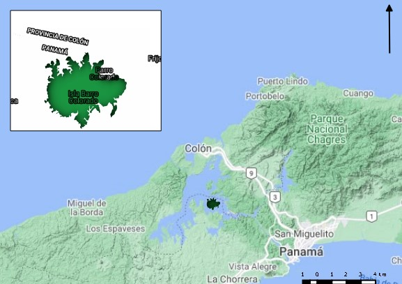

# Introducción

La vegetación terrestre está constituida por un conjunto de plantas pertenecientes a una familia en específico y esta a su vez se subdividen en géneros y especies para identificarse dentro de su clase. Por consiguiente no sería la excepción de la malvaceae, poseen 243 genéros y más de 4,300 especies, sus flores son hermafroditas, pocas veces unisexuales, solitarias o fasciculadas en las axilas de las hojas o agrupadas en inflorescencia tal como la describen los siguientes autores [@marinanalisis] y [@bayer2003malvaceae].

Dentro de los géneros a encontrar en la familia malvaceae están el abutilon constituido por arbustos, subarbustos y hierbas bienales con pelo estrellados y tallos velloso, son carente del epicáliz conjunto de apéndices que por lo regular tienen otros grupos de dicha familia, así como de tener alrededor de 150 especie nativa en los trópicos y subtrópicos de América, África, Asia y Australia, [@de2007especies]. También, está el Hibiscus donde los segmentos del epicáliz estan libres o unidos en la base, con estigmas alargados, semillas reniformes y numerosas, [@ortizclaves]. Del mismo modo, se encuentra la althaea, lavatera y la malva cada una contienen sus respectivas especies las cuales pueden encontrarse en mayor o menor proporción en un espacio determinado la cual dependerá de factores abioticos incidentes entre ellos, lo que implicaría la necesidad de utilizar tecnicas y análisis numerológicos para conocer su asocianción. 

La implementación de análisis numéricos en las investigaciones ecológicas permiten dar a conocer en terminos cuantificables la forma en que se encuentran asociadas y el tipo de patrón que presenta algunas especies, es por ello la importancia de la estratificación y zonificación del objeto de estudio en cuestión. De acuerdo con [@gonzalez2006ecologia] esto permite conjugar en un mismo grupo información de aquellos organismos que pueden ser cuantificable junto con otros que son reproductivos y de manera general con toda la vegetación.

Este estudio busca conocer cómo estan asociados los diferentes géneros y especies de la familia malvaceae y si las variables ambientales existente en la zona influyen en dicha asociación. También, analizar como estan organizados los grupos y qué patrón presentan en caso de que existiese, así, como establecer los indicadores ambientales que interfieren. De igual manera, examinar en qué volumen se encuentran representadas cada una y distiguir las especies alpha y beta, además, de construir modelos de distribución espacial para idenficarla. En tal sentido, esta investigación constribuirá al conocimiento de la dinámica ecológica espacial que envuelven las plantas pertenecientes a la familia malvaceae en la isla Barro Colorado que en lo adelante será llamado BCI y con la misma gestionar estrategias para el cuidado y conservación de estas. 

\ldots

# Metodología

## Área de estudio

La isla Barro Colorado se encuentra ubicada en el canal de Pánama en las proximidades del lago Gatún, de acuerdo con [@perez2005metodologia] esta se formó cuando se construyó dicho canal embalsando las aguas del río Chagres, se localiza entre las coordenadas geográficas 9 grados con 09 minutos al Norte y 79 grados con 51 minutos al Oeste y cubre una extensión de tierra de 1,500 hectáreas (ver figura \ref{mapa}). El clima es de bosque tropical, la temperatura promedio es de 27 grados centígrados, con temporadas lluviosas durante los meses mayo-diciembre y secas desde mediados de diciembre hasta abril, las tormentas convectivas son prevenidas por los vientos alisios dictando así las estaciones del año, [@sugastimedicion].  

\ldots

# Resultados

\ldots

# Discusión

# Agradecimientos

# Información de soporte

\ldots

# *Script* reproducible

\ldots

# Referencias
